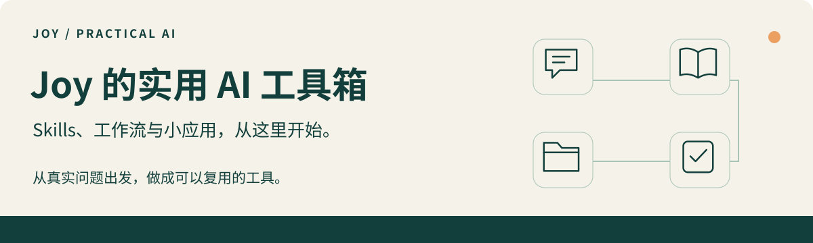

# Joy 的实用 AI 工具箱

**从业务一线探索 AI Agents，把反复打磨的方法做成可以复用的 Skills、工作流与小应用。**

[从这里开始](docs/start-here.md) · [浏览全部作品](#按场景找工具) · [实践手记](#实践手记) · [认识 Joy](https://github.com/JoyZhang666)

第一次接触 Skill？它是一套交给 AI Agent 阅读和执行的工作说明，有些还附带脚本和模板。先选一个具体任务，再按项目指南准备环境。

## 先看这三件作品

### [Get 会议行动](getnote-meeting-actions/README.md)

**输入**：你选定的 Get 会议原文，以及希望处理的范围。  
**交付**：带原文依据和稳定编号的行动清单；获授权执行后保存本地成果与续接记录。

[了解并开始 →](getnote-meeting-actions/README.md)

### [Youtube 转写全文稿](youtube-transcript/README.md)

**输入**：一个有权处理的 YouTube 视频链接，以及本地保存目录。  
**交付**：按来源顺序保存的 Markdown 全文稿草稿，附来源与待核对标识；中断结果不能当作完整交付。

[了解并开始 →](youtube-transcript/README.md)

### [全书精读工作流](full-book-deep-reading-workflow/README.md)

**输入**：你有权使用的书籍或章节文件，及本次阅读范围。  
**交付**：有原文定位的逐章笔记、阅读进度和范围明确的综述，可接续上次阅读。

[了解并开始 →](full-book-deep-reading-workflow/README.md)

## 按场景找工具

### 会议与执行

- **[Get 会议行动](getnote-meeting-actions/README.md)** — 带原文依据和稳定编号的行动清单；获授权执行后保存本地成果与续接记录。 `v2.0.0`

### 知识与阅读

- **[Youtube 转写全文稿](youtube-transcript/README.md)** — 按来源顺序保存的 Markdown 全文稿草稿，附来源与待核对标识；中断结果不能当作完整交付。 `v2.2.1`
- **[全书精读工作流](full-book-deep-reading-workflow/README.md)** — 有原文定位的逐章笔记、阅读进度和范围明确的综述，可接续上次阅读。 `v2.0.1`
- **[GetNote 知识库整理](getnote-knowledge-manager/README.md)** — 分类建议；在有效授权下归档，并逐条记录实际知识库 ID 的核验结果。 `v2.0.0`

### 内容创作

- **[微信公众号写作助手](kb-to-wechat-article/README.md)** — 从笔记、资料和想法写出有依据的文章；新手逐步引导，知识库可跳过，按需配图与送草稿箱。 `v4.15.0`

### 文档生成

- **[适合手机阅读的 PDF 生成器](mobile-pdf-report/README.md)** — 将 Markdown/HTML 排版为窄幅 PDF，支持受限本地素材；真实隔离渲染尚未验收，使用前请阅读验证限制。 `v1.0.5`

### 日常管理

- **[项目文件管理](project-file-management/README.md)** — 工作区索引、项目登记与交接记录；本地辅助工具提供检查结果。 `v1.1.2`
- **[课程课时台账](class-hours-ledger/README.md)** — 本地课时流水、余额查询和一致性备份，不联动资金账本。 `v1.1.0`

### 技术工具

适合已有 Linux 与网络基础的使用者；请先阅读各项目的外部条件和能力边界。

- **[mihomo 安装与运维](mihomo-vpn-install/README.md)** — 安装检查、配置与排障记录、回滚指引；实际变更按授权执行和核验。 `v2.1.2`
- **[Crossborder Tunnel Kit](crossborder-tunnel-kit/README.md)** — 交付 Mihomo 客户端 YAML 和导入指引，附 VPS 准备、WARP 链式与故障索引；实际连通性须验收。 `v0.3.0`

## 实践手记

- [返回了文字，为什么还不能算“全文交付”？](docs/notes/transcript-completeness.md)
- [一个 Skill 公开前，如何检查隐私与来源？](docs/notes/publish-with-care.md)
- [怎样让第一次配置 API 的人走完最后一步？](docs/notes/first-api.md)

## 维护方式

各作品的版本、依赖、测试范围和限制以目录内 README、SKILL 与变更记录为准。反馈问题时请使用虚构或脱敏示例：[提交 Issue](https://github.com/JoyZhang666/joy-agent-skills/issues)。

## 来源与许可

Get 会议行动基于 [Zara（zarazhangrui）的 lark-minutes-tasks](https://github.com/zarazhangrui/lark-minutes-tasks) 改编。改编范围及参考版本见[来源记录](getnote-meeting-actions/references/upstream.md)，原始 MIT 版权及许可全文保留于该 Skill 的 [LICENSE](getnote-meeting-actions/LICENSE)。各作品以所在目录的许可证为准。

## 隐私

本仓库仅收录通用说明、脚本和空白模板。真实会议、个人配置、客户资料、登录凭据和运行日志不纳入仓库。上传前逐项检查文件；网页上传也需要人工检查，不能依赖 .gitignore 自动阻止敏感文件上传。

