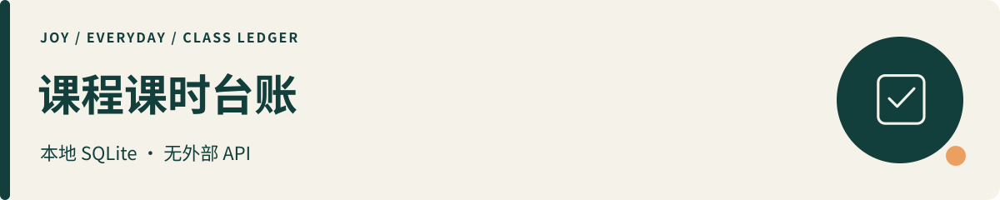

# 课程课时台账 · Class Hours Ledger

**用自然语言记课，用数据库留账。买了多少、上了几次、还剩多少，随时查得清。**

这是一个交给 AI Agent 使用的个人课程台账 Skill。告诉它一次购课、赠课或上课记录，Agent 核对必要信息后调用脚本入账；需要对账时，再从本地数据库读取流水和余额。日常使用可以像聊天一样简单，背后则有固定的计算规则、逐笔记录和备份。

**它的精髓：AI 负责理解与确认，Python 负责计算与校验，SQLite 负责持久保存。** 换一次对话后，只要 Agent 获准访问同一份数据库，就能接着查账、记账，让记录持续积累。

| 你想做什么 | 它能交付什么 |
|---|---|
| 记下购买、赠送和消耗的课时 | 带日期、课程、教练、备注和入账后余额的逐笔流水 |
| 核对“还剩几节、余额怎么来的” | 从流水重新核算的余额与完整记录，便于和机构对账 |
| 更正已确认的记账错误 | 追加调整记录并注明原因，保留原有流水供追溯 |
| 长期维护自己的课程记录 | 指定目录中的 SQLite 数据库，以及每次入账后生成的一致性备份 |

**轻量运行：**Python 3.10+ 标准库与 SQLite 支持，无第三方 Python 依赖；台账脚本不调用外部 API，无需为台账另建服务器。自然语言交互由你使用的 Agent 提供。

[第一次使用 Skill](../docs/start-here.md) · [记账技能入口](SKILL.md) · [返回全部作品](../README.md)

## 哪些课程可以记？

适合个人或家长管理**按课时购买、逐次扣减**的课程包，例如：

| 场景 | 常见课程 |
|---|---|
| 运动与体能 | 健身私教、普拉提、瑜伽、游泳、网球、羽毛球 |
| 音乐与艺术 | 钢琴、吉他、声乐、舞蹈、绘画、书法 |
| 语言与学习 | 外语口语、一对一学科辅导、编程、棋类 |

**以上都以当前计量规则为前提：每节一小时、整课时增减。** 45 分钟、90 分钟、半节扣费或混合时长的课程，目前不适用。

**一个数据库对应一套独立余额。** 不可互抵的不同机构、学员或课程包，请分别建库；课程名称只是记录字段，修改名称不会自动分账。它适合维护个人留底、续课前核对余额、与机构逐笔对账；不承担机构排课、收款或自动到期提醒。

## 像聊天一样记下一次上课

以下为完全虚构的使用示例，假设已选定“绘画练习”专用账本，每节一小时：

> “请记录：2026 年 1 月 1 日买了 10 节绘画课，支付 800 元，长期有效，另赠 2 节。”  
> “请记录：1 月 2 日上了 1 节，老师是示例老师。”  
> “查一下剩余课时，把流水列出来让我核对。”

Agent 按 Skill 规则确认信息，分别记录购课、赠课和上课。预期账目为：

| 业务日期 | 事项 | 课时变化 | 结余 |
|---|---|---:|---:|
| 2026-01-01 | 购课 | +10 | 10 |
| 2026-01-01 | 赠课 | +2 | 12 |
| 2026-01-02 | 上课 | −1 | 11 |

这是交互与账目示意，不是真实用户资料或运行截图。日期、课时或有效期等信息不全时，Agent 应先询问，不能自行补成事实。

## 准确、长期、可追溯，靠什么实现？

| 你关心的事 | 已实现的机制 |
|---|---|
| **账算得清楚** | 脚本检查日期和课时等字段；按逐笔流水重算余额，核对记录中的结余；购课金额以整数“分”保存。Agent 读取程序结果后再回答。 |
| **重试少记重账** | 每次操作绑定唯一请求 ID。同一 ID、相同内容重试返回原记录；同一 ID、不同内容会拒绝。写入通过事务串行处理。 |
| **记录能长期接续** | 数据保存在 Skill 目录之外的明确数据库路径。保留数据库并让后续 Agent 使用同一路径，即可继续积累，不受单次聊天长度限制。 |
| **每笔变化能追溯** | 流水保留记录 ID、业务日期、类型、课时变化、入账后余额与备注等字段；按流程用追加调整更正，留下更正原因。 |
| **有检查，也有备份** | 读写时核对数据库完整性、流水余额及记录摘要；每次入账或同 ID 重试后生成独立命名的一致性备份。备份失败会单独报错，已入账状态仍明确告知。 |

这些机制提供的是**可核对、可接续的记账基础**。输入仍须真实、完整；换一个请求 ID 重复提交同一件事，系统不能自动识别为重复。内部校验不能证明没有漏记，也不提供防篡改保证。同磁盘备份仍需用户另行安排异地备份，才能应对磁盘损坏。

台账脚本不上传数据库；如果使用云端模型，交给 Agent 的对话及其读取内容仍受宿主的数据处理规则约束。

---

**1.1.0 · MIT**。支持购课、赠课、上课、调整和手动登记过期扣减；记录有效期，不自动执行到期扣课，不联动资金账本。

## 环境与使用

Python 3.10+ 标准库（需 SQLite 支持），无第三方 Python 依赖。将本目录放在支持 SKILL.md 的宿主中，或直接使用 CLI。跨宿主自动发现和真实业务环境未全面验收。

先在 Skill 目录之外创建一个专用数据目录，再将以下 `<data>` 替换为实际路径；带空格路径按本机 shell 规则加引号：

```text
python class_ledger.py --db <data>/classes.db init
python class_ledger.py --db <data>/classes.db add 2026-01-01 purchase 10 --paid 800 --valid-until 无限期 --request-id purchase-example-001
python class_ledger.py --db <data>/classes.db add 2026-01-02 attend -1 --request-id attend-example-001
python class_ledger.py --db <data>/classes.db verify
python class_ledger.py --db <data>/classes.db report
```

示例完全虚构；预期余额为 9 节。金额按分存储并以 JSON 输出。同一请求 ID 和相同字段重试不会重复记账；同 ID 不同字段会拒绝。每次操作仍应保管请求 ID。

退出码：0 成功；1 错误；2 已入账但备份失败（勿换 ID 重复入账）。备份采用 SQLite 一致性备份，文件名唯一，保留全部备份，用户自行审阅后清理。数据库和备份只留本地。

## 1.1.0 的兼容变化

必须显式 --db，新增 init、--request-id；新 schema 使用整数分，**不直接兼容 1.0 数据库**。迁移前备份，另行审查字段映射。此发布未读取或迁移任何真实数据库。

完整性检查是内部一致性核对，不是防篡改或漏录证明。负余额可记录但会警告。并发写入串行化；数据库仍应位于可靠的本地磁盘，不建议放网络共享盘。参考 [SQLite 接口](https://docs.python.org/3/library/sqlite3.html)。

流程与权限见 [SKILL.md](SKILL.md)。保留提供者原包的 [MIT LICENSE](LICENSE)，本次修订未复制外部项目代码。反馈请提交[脱敏 Issue](https://github.com/JoyZhang666/joy-agent-skills/issues)，不要上传实际数据库。
