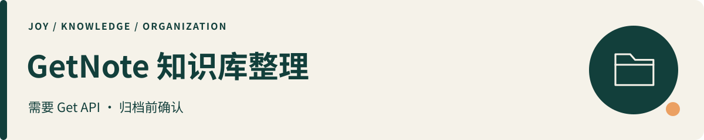

# getnote-knowledge-manager

**知识与阅读 · 需要 Get API · 归档前确认**

| 你提供什么 | 得到什么 |
|---|---|
| 近期 Get 笔记的时间范围、目标知识库与分类规则。 | 分类建议；在有效授权下归档，并逐条记录实际知识库 ID 的核验结果。 |

**先准备**：Python 3.10+、Get 官方 API、用户自己的 API Key 与 Client ID，以及相应读写权限。

[第一次使用 Skill](../docs/start-here.md) · [配置与授权流程](SKILL.md) · [返回全部作品](../README.md)

看一个虚构示例

> 虚构笔记“周末阅读想法” → 建议归入“阅读”｜状态：建议待确认，尚未归档。

仅示意输入或输出的形式，不是真实用户资料或运行结果。

---

版本：2.0.0。读取近期 Get 笔记，建议知识库分类，在有效授权下归档，并按实际知识库 ID 核验结果。

## 依赖与使用

Python 3.10+，仅标准库；可访问 Get 笔记官方 API。需要用户自己的 GETNOTE_API_KEY、GETNOTE_CLIENT_ID 环境变量及具有相应读写权限的应用。Skill 不安装软件、不生成真实凭据。

~~~sh
python scripts/get_recent_notes.py 24
python scripts/proposal_gate.py proposal.json --account-id "$GETNOTE_CLIENT_ID"
python scripts/batch_archive.py --state proposal.json
~~~

命令示例使用 POSIX shell；Windows PowerShell 的环境变量语法为 $env:GETNOTE_CLIENT_ID。proposal.json 应放在私人任务目录，不放在本 Skill 目录。

首次需按授权文档生成私人 credential_binding；API Key 轮换后旧授权不能复用，先只读核对旧任务，再为剩余工作重新授权。

首次使用先看 [SKILL.md](SKILL.md) 和 [授权状态格式](references/authorization.md)。分类模板是 [虚构示例](references/knowledge_bases.md)，实际知识库映射另存任务目录。

- 默认人工明确同意；已有具体执行指令无需重复批准。
- 自动模式必须事先明确启用、限定范围和有效期；未回复不是授权。
- 列表使用 cursor/has_more，保持 note_id 为字符串。最多读取 1,000 页，超限明确失败，不输出误导性的“完整”结果。
- 归档每份提案最多 20 条；输出逐条成功、失败或不确定。只看 API 请求返回不能认定归档成功。
- 账本保存写入尝试；同一提案恢复只查询，不重放写请求。账号级锁要求所有执行器共用同一个任务状态目录。

退出码：读取/门禁/参数错误为 2；归档全部验证成功为 0，含失败或不确定为 1。应同时读取 JSON 状态，不能只解析成功图标。

## 2.0.0 兼容性变化

移除无授权状态的直接写入命令与默认沉默同意。新增实际写入口门禁、独立自动授权策略、提案摘要绑定、原子账本与并发锁。修复分页、去重、业务错误处理及知识库核验。原 1.2.0 状态文件不能直接使用。

已做虚构 API 响应和本地逻辑回归；没有执行真实账号集成测试。自动化消息回执的真实性由宿主 Agent 根据实际用户指令和工具结果记录，JSON 文件本身不构成人类授权证明。分类准确性仍需要真实任务审阅。

官方接口依据：[API 文档](https://doc.biji.com/docs/WOxgwObNNiyMHWk1dl0cJqSxnEd)。MIT 许可见 [LICENSE](LICENSE)。
